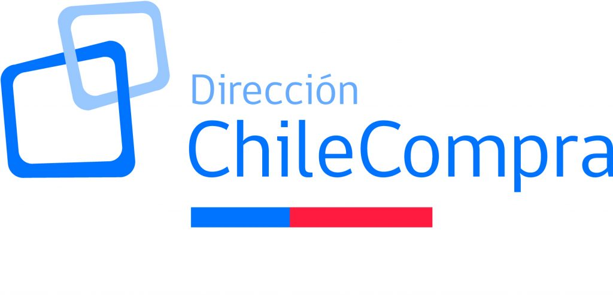
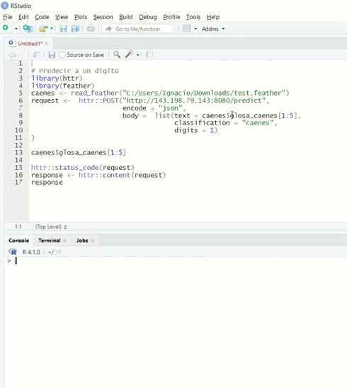

class: center, middle

.linea-superior[]
.linea-inferior[]





## Experiencias relevantes y aportes para el cargo

### Proceso de selección cargo Jefatura Depto Observatorio ChileCompra

#### 21 de Abril 2022

```{r setup, include=FALSE}
options(htmltools.dir.version = TRUE)
knitr::opts_chunk$set(message = FALSE) 
```

```{r xaringan-themer, include=FALSE, warning=FALSE}
library(xaringanthemer)
#style_duo_accent(
 # primary_color = "#1381B0",
  #secondary_color = "#FF961C",
  #inverse_header_color = "#FFFFFF"
#)
```


---

background-image: url("imagenes/fondo-cc-up.PNG")
background-size: contain;
background-position: 100% 0%

# Presentación

--

- .medium-par[Ignacio Agloni]

--

- .medium-par[Sociólogo, Universidad de Chile]

--

- .medium-par[Magister**(c)** en Tecnologías de la Información, Universidad de Chile]

--

  - Diplomado en Inteligencia Artificial, Universidad de Chile

--

  - Diplomado en Big Data para Políticas Públicas, UAI

--

- .medium-par[Jefe de Proyecto Servicios Compartidos para la Producción Estadística, INE]

--

- .medium-par[Jefe de Proyecto Piloto por cambio de marco Casen 2022, INE con MDSF]

---

background-image: url("imagenes/fondo-cc-up.PNG")
background-size: contain;
background-position: 100% 0%

# Experiencias relevantes para el cargo

--

- **Liderazgo en desarrollo de iniciativas de modernización tecnológica** para mejorar la **eficiencia y eficacia** en el negocio

--

.pull-left[**Paquete en R para** evaluación de precisión de estimaciones en encuestas. Link repositorio en GitHub: [paquete calidad](https://github.com/inesscc/calidad)]


.pull-rigth[]

--

.pull-left[API para **codificación automática** de clasificadores con *machine learning*. Link repositorio en GitHub: [INE classifiers](https://github.com/inesscc/ineclassifiers)]

.pull-rigth[]

---

background-image: url("imagenes/fondo-cc-up.PNG")
background-size: contain;
background-position: 100% 0%

# Experiencias relevantes para el cargo


- **Liderazgo en desarrollo de iniciativas de modernización tecnológica** para mejorar la **eficiencia y eficacia** en el negocio

</br>

--

**Capacitación institucional R y herramientas de productividad** (aprox 180 personas)


--

Diseño de estándares de **arquitecturas de información** para procesamiento de datos

--

</br>

- Experiencia en **manejo de presupuestos en el Estado** y como **comprador público**

</br>

--

Gestión presupuestaria piloto Casen 2022

---

background-image: url("imagenes/fondo-cc-up.PNG")
background-size: contain;
background-position: 100% 0%

# Aportes para el cargo

--

</br>

- Conocimiento en **validación**, **depuración** y **analítica** aplicable a los datos producidos para la labor de fiscalización del observatorio

--

- Revisión y mejora de **arquitecturas de información** en el Observatorio 

--

- Revisión y mejora de flujos de procesamiento de datos para lograr **reproducibilidad**, **replicabilidad**, **trazabilidad**

--

- **Reportería automatizada** de indicadores para clientes internos y usuarios externos

--

- Generación de *dashboards* de indicadores y visualizaciones para difundir el trabajo del Depto con el ecosistema de compras públicas y la ciudadanía, desde una perspectiva de **probidad** y **transparencia**

---

background-image: url("imagenes/fondo-cc-up.PNG")
background-size: contain;
background-position: 100% 0%

# Aportes para el cargo

--

</br>

- Investigar e implementar **metodologías de *machine learning* e IA para construir herramientas de prevención y detección de errores**, con alto potencial en detección temprana y priorización de revisión directa.

--

- **Estimular un buen clima de trabajo en el equipo** y el **aprendizaje continuo** de herramientas de productividad

---

class: center, middle

.linea-superior[]
.linea-inferior[]


## Experiencias relevantes y aportes para el cargo

### Proceso de selección cargo Jefatura Depto Observatorio ChileCompra

#### 21 de Abril 2022
