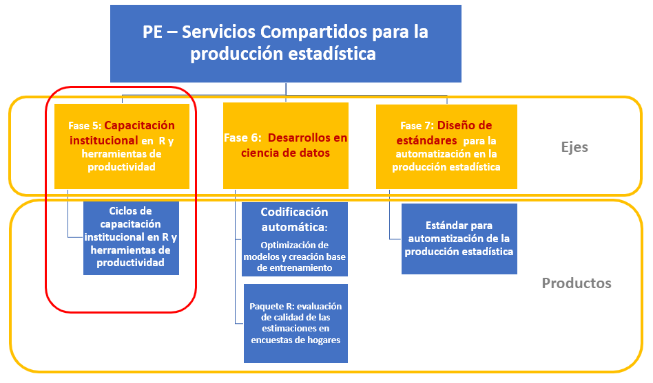

class: center, middle

.linea-superior[]
.linea-inferior[]


## Experiencias relevantes y aportes para el cargo

### Proceso de selección cargo Jefatura Depto Observatorio ChileCompra

#### 21 de Abril 2022

```{r setup, include=FALSE}
options(htmltools.dir.version = TRUE)
knitr::opts_chunk$set(message = FALSE) 
```

```{r xaringan-themer, include=FALSE, warning=FALSE}
library(xaringanthemer)
#style_duo_accent(
 # primary_color = "#1381B0",
  #secondary_color = "#FF961C",
  #inverse_header_color = "#FFFFFF"
#)
```


---

background-image: url("imagenes/fondo-cc-up.PNG")
background-size: contain;
background-position: 100% 0%

# Presentación

--

- .medium-par[Ignacio Agloni]

--

- .medium-par[Sociólogo, Universidad de Chile]

--

- .medium-par[Magister**(c)** en Tecnologías de la Informacíón, Universidad de Chile]

--

  - Diplomado en Inteligencia Artificial, Universidad de Chile

--

  - Diplomado en Big Data para Políticas Públicas, UAI

--

- .medium-par[Jefe de Proyecto Servicios Compartidos para la Producción Estadística, INE]
- .medium-par[Jefe de Proyecto Piloto por cambio de marco Casen 2022, INE]

---

background-image: url("imagenes/fondo2.PNG")
background-size: contain;
background-position: 100% 0%

# Estructura PE SSCC


.right[]


---

background-image: url("imagenes/fondo2.PNG")
background-size: contain;
background-position: 100% 0%

# Estructura PE SSCC



---

class: center, middle

.linea-superior[]
.linea-inferior[]


## Experiencias relevantes y aportes para el cargo

### Proceso de selección cargo Jefatura Depto Observatorio ChileCompra

#### 21 de Abril 2022
